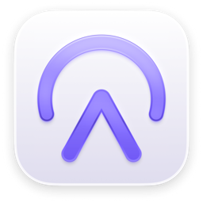
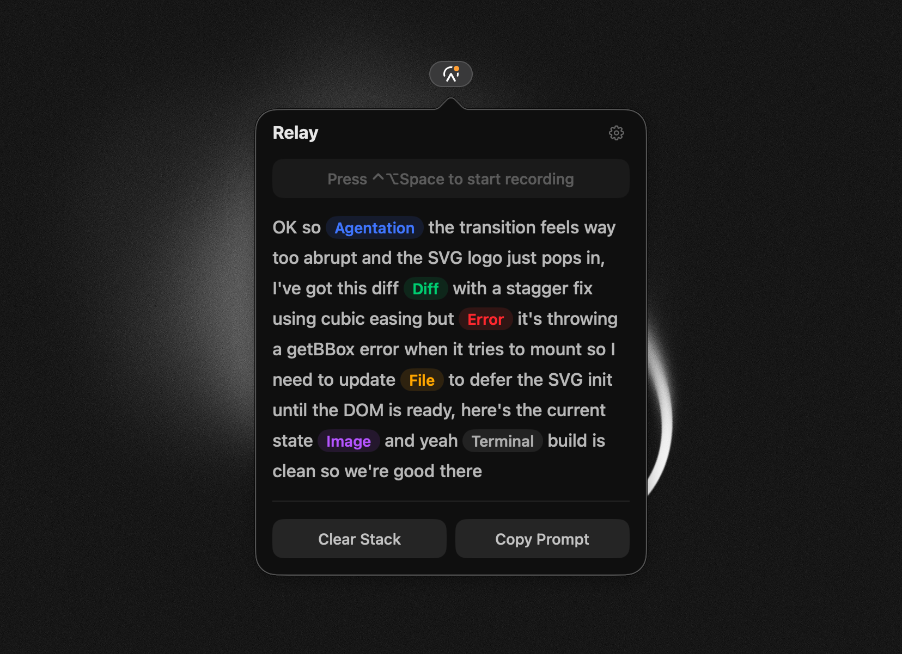

# Relay

A macOS menu bar app that captures clipboard items and voice notes into structured LLM prompts.

## What it does

Copy things — code snippets, URLs, terminal output, text — and Relay collects them in a context stack. Drop in screenshots, files, and folders for additional context. Record a voice note to describe what you want. Hit compose and get a structured prompt in Markdown (with XML toggle) ready to paste into any LLM.



## Features

- **Clipboard capture** — Automatically collects what you copy with content type detection (code, URL, terminal, JSON, text)
- **Screenshots, files, and folders** — Drag and drop images, files, or entire folders to add them as context
- **Voice notes** — Record and transcribe with native macOS speech recognition, WhisperKit, or FluidAudio
- **Prompt composition** — Generates structured prompts in Markdown format, with an option to switch to XML
- **Global hotkeys** — Customizable keyboard shortcuts for recording and composing
- **Menu bar native** — Lives in your menu bar, stays out of the way

## Install

Download the latest DMG from [Releases](https://github.com/msllrs/relay/releases), drag to Applications, then right-click → Open on first launch (ad-hoc signed).

## Build from source

Requires macOS 15+ and Swift 6.0 toolchain.

```
git clone https://github.com/msllrs/relay.git
cd relay
./build-app.sh
open .build/Relay.app
```

Use `./build-app.sh --release` for an optimized build. Use `./make-dmg.sh` to create a distributable DMG.

## License

© 2025 Matt Sellers

Licensed under [PolyForm Shield 1.0.0](LICENSE.md)
