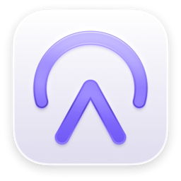
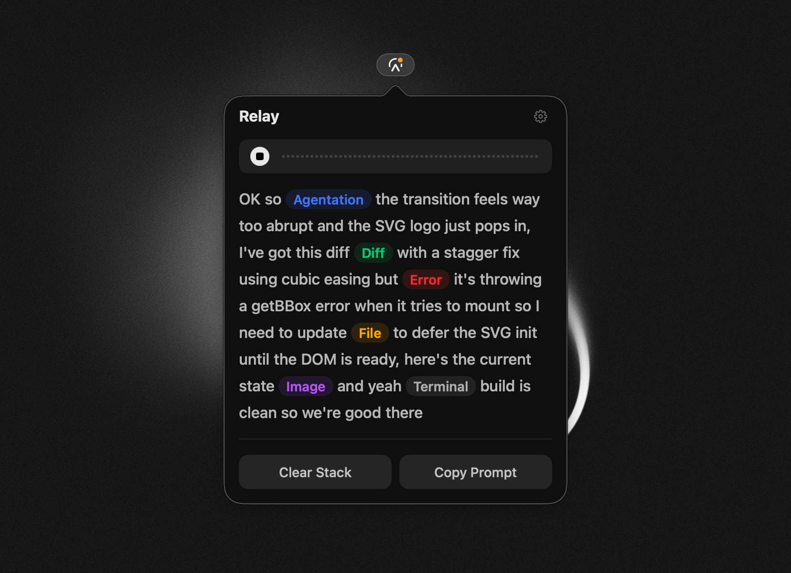

# Relay

A macOS menu bar app that lets you build rich LLM prompts by combining clipboard captures and voice notes. It bridges the gap between _"I have stuff on screen"_ and _"I need to explain it to an llm."_

## What it does

As you dictate, clipboard captures are woven inline with your transcription, landing exactly where you referenced them. No copy-paste choreography, just talk and the context assembles itself into a structured Markdown prompt ready to paste into any LLM.



## Features

- **Clipboard capture** — Automatically collects what you copy with content type detection (code, URL, terminal, JSON, text)
- **Screen annotations** — Hold a shortcut and draw directly on your screen. Relay recognizes the gesture — circle, X, arrow, or highlight — captures the marked region, and attaches the intent ("focus here", "remove this", "points to this") so the LLM knows what you meant. Draw mid-dictation and the annotation lands inline with your words; committed marks melt away in a puff of smoke
- **Screenshots, files, and folders** — Drag and drop images, files, or entire folders to add them as context
- **Voice notes** — Record and transcribe with native macOS speech recognition, WhisperKit, or Parakeet; pick a specific input device or follow the system default, with seamless mid-recording handoff when devices connect or disconnect
- **Recording overlay** — A draggable floating indicator that springs out of the menu bar, shows live audio levels, flashes on new clipboard captures, and doubles as a stop button
- **Claude Code integration** — An MCP bridge exposes your context stack directly to Claude Code (`relay_get_context` and friends), so agents can pull what you've collected without any copy-paste
- **Prompt composition** — Generates structured prompts in Markdown format, with an option to switch to XML
- **Auto-paste** — Optionally copy and paste the result straight into the focused app after dictation
- **Transcript cleanup** — Three modes for transcription output: Raw (verbatim), Clean (strips filler words like "um" and "basically"), and Formatted (clean + capitalization, deduplication, punctuation)
- **Global hotkeys** — Customizable keyboard shortcuts for recording and annotation

## Annotations

Hold the annotation shortcut (default `⌘⇧A`) and draw on your screen; release to capture. What you draw sets the intent attached to the image:

| Gesture | Meaning |
| --- | --- |
| Circle / lasso | Focus here — this is the relevant element |
| X | Delete or remove this |
| Arrow | Points to this — a direction, move, or relationship |
| Anything else | Highlighted region |

Multi-stroke gestures work naturally — an arrow drawn as shaft-then-head, an X as two lines — and capture can crop to the mark or grab the full screen (Settings → Annotation). With "Annotate while recording" on, marks land inline with your dictation as you speak. Annotations require the Screen Recording permission.

## Claude Code integration

Enable **Settings → Integration → MCP bridge for Claude Code**, then register the bundled MCP server in your project's `.mcp.json`:

```json
{
  "mcpServers": {
    "relay": {
      "command": "node",
      "args": ["/path/to/relay/relay-mcp/dist/index.js"]
    }
  }
}
```

Claude Code can then pull your context directly: `relay_get_context` (the composed prompt), `relay_get_stack` (the raw item stack), `relay_get_status` (recording state), and `relay_stop_and_get_context` (finish dictation and fetch in one step).

## Install

Download the latest DMG from [Releases](https://github.com/msllrs/relay/releases) and drag to Applications.

## Build from source

Requires macOS 15+ and Swift 6.0 toolchain.

```
git clone https://github.com/msllrs/relay.git
cd relay
./build-app.sh
open .build/Relay.app
```

Use `./build-app.sh --release` for an optimized build. Use `./build-app.sh --notarize` to create a signed, notarized release with DMG.

## Troubleshooting

**Global hotkey stops toggling recording** — On older versions, the hotkey could get into a state where it no longer started or stopped recording correctly. This was fixed in v0.3.3. If you're on an older version, update or reinstall from [Releases](https://github.com/msllrs/relay/releases).

## License

© 2026 Matt Sellers

Licensed under [PolyForm Shield 1.0.0](LICENSE.md)
